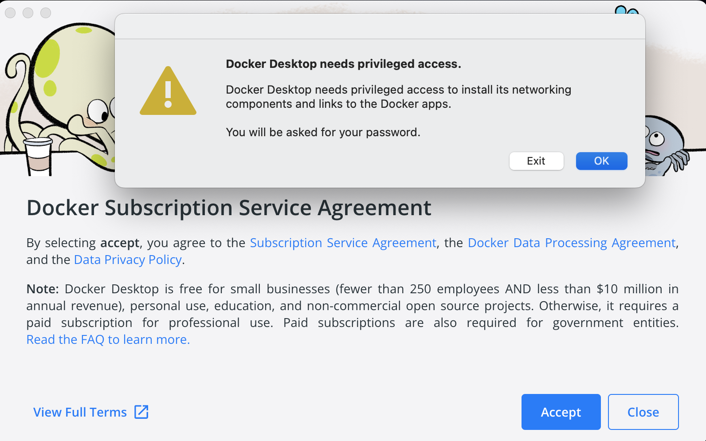
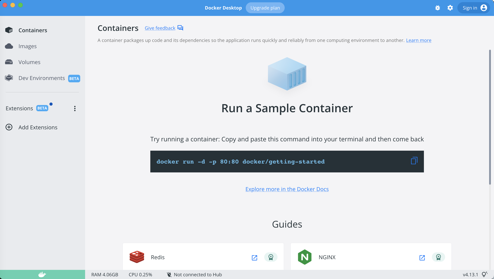
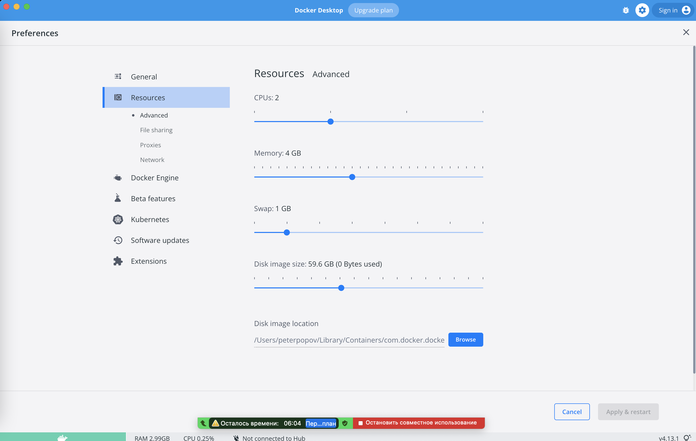

# Инструкция по установке Docker на Mac

&#9668; [Docker и Docker Compose](docker.md)

### Ссылки

- [Install Docker Desktop on Mac](https://docs.docker.com/desktop/install/mac-install/) (En)

Установка `Docker` и `docker-compose` на `Mac` сводится к установке `Docker Desktop` по инструкции из официальной документации.

### 1. Устанавливаем Docker

Переходим на сайт [документации](https://docs.docker.com/desktop/install/mac-install/) и жмём на одну из кнопок для скачивания установщика.  
[Docker Desktop for Mac with Intel chip](https://desktop.docker.com/mac/main/amd64/Docker.dmg?utm_source=docker&utm_medium=webreferral&utm_campaign=docs-driven-download-mac-amd64)  
или  
[Docker Desktop for Mac with Apple silicon](https://desktop.docker.com/mac/main/arm64/Docker.dmg?utm_source=docker&utm_medium=webreferral&utm_campaign=docs-driven-download-mac-arm64)

Если не знаем, какой у нас процессор, проверить можно здесь:  
[Как понять, какой процессор у вашего Mac – Intel или Apple Silicon](https://it-here.ru/instruktsii/kak-ponyat-kakoj-protsessor-u-vashego-mac-intel-ili-apple-silicon/)

После скачивания установщика запускаем его для установки `Docker Desktop`.

После установки появится следующий экран:



Нажимаем `OK` и `Accept`, после чего ждём, когда установится `Docker Desktop`.

Если всё пройдет хорошо, то появится доступ к `Docker`! И следующий экран:

<div></div>
<div></div>

Далее сверху справа жмём шестеренку и попадаем в настройки Docker.  
Переходим в раздел `Resources` -> `Advanced`.



В этом разделе можно настроить доступные Docker ресурсы. Например, задать `Memory 4GB`.

Отлично! Установленный `Docker Desktop` уже включает в себя как `Docker`, так и `docker-compose`.

### 2. Проверяем

Должны работать следующие команды:

```bash
$ docker -v
Docker version 23.0.1, build a5ee5b1
```

```bash
$ docker ps
CONTAINER ID   IMAGE     COMMAND   CREATED   STATUS    PORTS     NAMES
```

```bash
$ docker-compose -v
docker-compose version 1.29.2, build unknown
```
